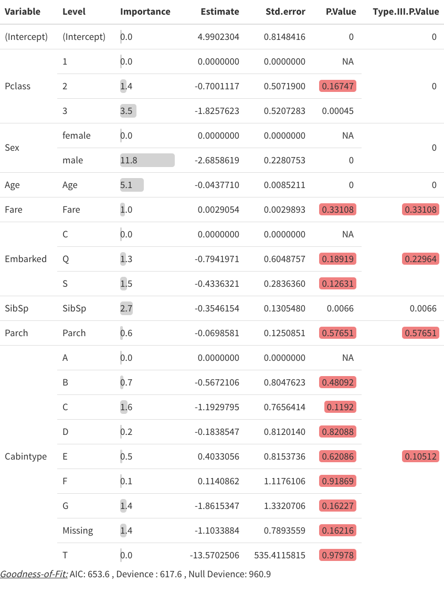

<!-- README.md is generated from README.Rmd. Please edit that file -->

# prettyglm

# overviewR 

<!-- badges: start -->

<!-- badges: end -->

The goal of prettyglm is to easily create beautiful coefficient
summaries for Generalised Linear Models.

## Installation

You can install the development version from
[GitHub](https://github.com/) with:

``` r
# install.packages("devtools")
devtools::install_github("jared-fowler/prettyglm")
```

## A Simple Example

To explore the functionality of prettyglm we will use the titanic data
set to perform logistic regression. This data set was sourced from
<https://www.kaggle.com/c/titanic/data> and contains information about
passengers aboard the titanic, and a target variable which indicates if
they survived.

``` r
library(prettyglm)
library(dplyr)
data("titanic")
```

### Pre-processing

A critical step for this package to work well is to **set all
categorical predictors as factors**.

``` r
# Easiest way to convert multiple columns to a factor.
columns_to_factor <- c('Pclass',
                       'Sex',
                       'Cabin', 
                       'Embarked',
                       'Cabintype')
titanic  <- titanic  %>%
  dplyr::mutate_at(columns_to_factor, list(~factor(.)))
```

### Building a glm

For this example we will build a glm using `stats::glm()`, but
`prettyglm` also supports parsnip and workflow model objects which use
the `glm` model engine.

``` r
survival_model <- stats::glm(Survived ~ Pclass + Sex + Age + Fare + Embarked + SibSp + Parch + Cabintype, 
                             data = titanic, 
                             family = binomial(link = 'logit'))
```

### Create table of model coefficients with `pretty_coefficients()`

  - `pretty_coefficients()` automatically includes categorical base
    levels.
  - You complete a type III test on the coefficients by specifying a
    `type_iii` argument.
  - You can return the dataset instead of `kable` but setting
    `Return_Data = TRUE`

<!-- end list -->

``` r
pretty_coefficients(survival_model, type_iii = 'Wald')
```

<p align="center">



</p>
